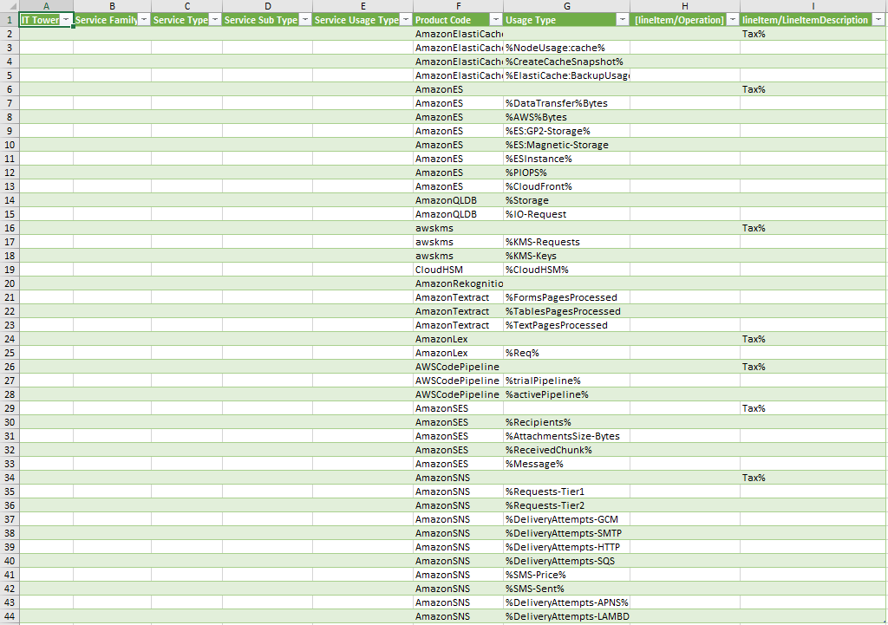
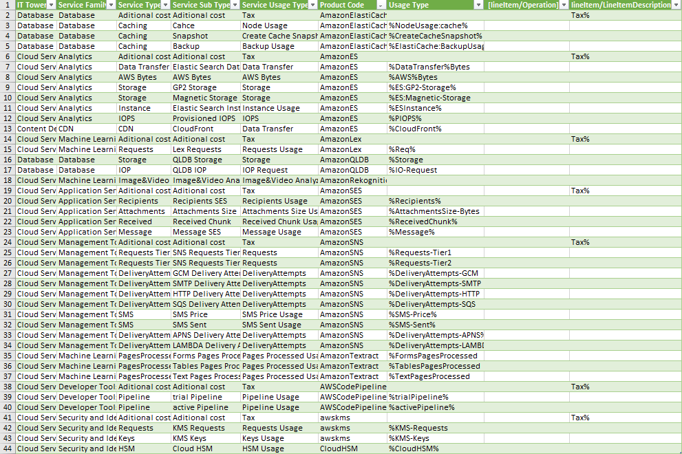

# Облачная лаба 1

## Цель работы:
Знакомство с облачными сервисами. Понимание уровней абстракции над инфраструктурой в облаке. Формирование понимания типов потребления сервисов в сервисной-модели. 
## Дано: 
* Слепок данных биллинга от провайдера после небольшой обработки в виде SQL-параметров. Символ % в начале/конце означает, что перед/после него может стоять любой набор символов.
* Образец итогового соответствия, что желательно получить в конце. В этом же документе

Слепок данных биллинга от провайдера

## Необходимо: 
* Импортировать файл .csv в Excel или любую другую программу работы с таблицами. Для Excel делается на вкладке Данные – Из текстового / csv файла – выбрать файл, разделитель – точка с запятой.
* Распределить потребление сервисов по иерархии, чтобы можно было провести анализ от большего к меньшему (напр. От всех вычислительных ресурсов Compute дойти до конкретного типа использования - Выделенной стойка в датацентре Dedicated host usage).
* Сохранить файл и залить в соответствующую папку на Google Drive.
## Алгоритм работы:
Сопоставить входящие данные от провайдера с его же документацией. Написать в соответствие колонкам справа значения 5 колонок слева, которые бы однозначно классифицировали тип сервиса. Для столбцов IT Tower и Service Family значения можно выбрать из образца.

## Результаты: 
Заполняю таблицу в соответствии с алгоритмом работы, описанном в задании

## Описание сервисов

### AmazonElastiCache
Это веб-сервис, который упрощает настройку, управление и масштабирование распределенного хранилища данных в памяти или среды кэширования в облаке. Он обеспечивает высокопроизводительное, масштабируемое и экономичное решение для кэширования
### AmazonES (Elasticsearch)
Это распределенный поисковый и аналитический движок на базе Apache Lucene. Обычно используется для таких примеров, как анализ журналов, полнотекстовый поиск, интеллектуальные системы безопасности, бизнес-аналитика и мониторинг текущих процессов.
### AmazonQLDB
Является управляемой базой данных, которая предоставляет неизменяемый журнал транзакций, проверяемый с помощью криптографии. Она позволяет отслеживать все изменения данных в приложении и хранить полную и проверяемую историю этих изменений с течением времени.
### AmazonRekognition
Это облачный сервис анализа изображений и видео, который позволяет легко добавлять в приложения расширенные возможности компьютерного зрения.
### AmazonSES (Amazon Simple Email Service)
Представляет из себя масштабируемый сервис электронной почты. Его можно использовать для отправки маркетинговых, уведомлений и транзакционных электронных писем.
### AmazonSNS (Amazon Simple Notification Service)
Это веб-сервис, который позволяет приложениям, конечным пользователям и устройствам мгновенно отправлять и получать уведомления из облака.
### AmazonTextract
Является сервисом для обнаружения и анализа текста на изображениях документа. Работает с форматированным текстом и может обнаруживать слова и строки слов, расположенные близко друг к другу. Он также может анализировать документ на наличие таких элементов, как связанный текст, таблицы, пары «ключ-значение» и элементы выбора
### AWSCodePipeline
Это сервис непрерывной доставки, который позволяет моделировать, визуализировать и автоматизировать шаги, необходимые для выпуска вашего программного обеспечения.
### awskms
Данный сервис шифрования предоставляет управление ключами, которые используют другие сервисы AWS. Его можно использовать для защиты данных в приложениях, использующих AWS
### CloudHSM
Это хранилище ключей, предлагающие безопасное хранение криптографических ключей и управляемые аппаратные модули безопасности в облаке AWS

## Вывод:

Выполнив данную лабораторную работу, познакомился со многими облачными сервисами Amazon, изучил их документацию
и составил таблицу, отражающую данные о каждом сервисе из слепка данных.