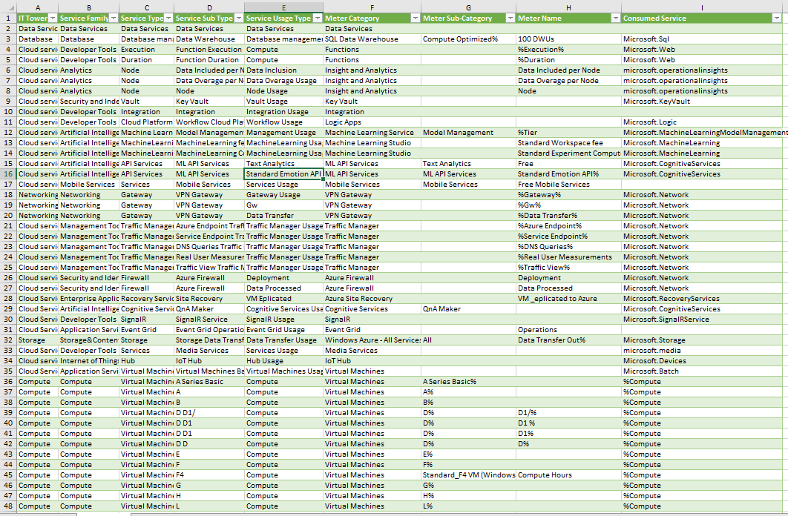

# Облачная лаба 2

Заполняю таблицу в соответствии с алгоритмом работы, описанном в задании

## Описание сервисов

### SQL Data Warehouse
Это решение для хранения данных нового поколения в Microsoft Fabric. Оно построено на базе механизма распределенной обработки корпоративного уровня, сводя к минимуму потребность в настройке и управлении. 
### Azure Functions
Данная служба, предоставляет всю постоянно обновляемую инфраструктуру и ресурсы, необходимые для запуска приложений. Functions обеспечивают бессерверные вычисления для Azure. Из можно использовать для создания веб-API, реагирования на изменения базы данных, обработки потоков Интернета вещей, управления очередями сообщений и многого другого.
### Operational Insights
Является функцией Dynamics 365 Commerce, предназначенная для того, чтобы предоставить клиентам лучший обзор работоспособности их служб и бизнес-функциональности путем отправки телеметрии непосредственно в принадлежащую клиенту учетную запись Application Insights.
### Azure Key Vault
Это одно из нескольких решений по управлению ключами в Azure, которое помогает решить следующие проблемы: управление секретами, управление ключами, управление сертификатами,   
### Azure Machine Learning
Данная облачная служба предназначена для ускорения жизненного цикла проекта машинного обучения (ML) и управления им. Специалисты по машинному обучению, специалисты по обработке данных и инженеры могут использовать его в своих повседневных рабочих процессах для обучения и развертывания моделей, а также управления операциями машинного обучения (MLOps)
### Azure VPN Gateway
Это служба, которую можно использовать для отправки зашифрованного трафика между виртуальной сетью Azure и локальными расположениями через общедоступный Интернет.
### Azure Traffic Manager
Это служба, которую можно использовать для отправки зашифрованного трафика между виртуальной сетью Azure. Она является балансировщиком нагрузки трафика на основе DNS. Эта служба позволяет распределять трафик общедоступных приложений по глобальным регионам Azure. 
### Azure Firewall
Является облачной интеллектуальной службой безопасности сетевого брандмауэра, которая обеспечивает защиту от угроз для облачных рабочих нагрузок, выполняемых в Azure. Это межсетевой экран с полным сохранением состояния как услуга со встроенными функциями высокой доступности и неограниченной облачной масштабируемостью
### Azure Site Recovery
Служба помогает обеспечить непрерывность в работе приложения, поддерживая его работу во время сбоев. Site Recovery реплицирует рабочие нагрузки, выполняемые на физических и виртуальных машинах (ВМ), с основного сайта на дополнительный. 
### CloudHSM
Это хранилище ключей, предлагающие безопасное хранение криптографических ключей и управляемые аппаратные модули безопасности в облаке AWS