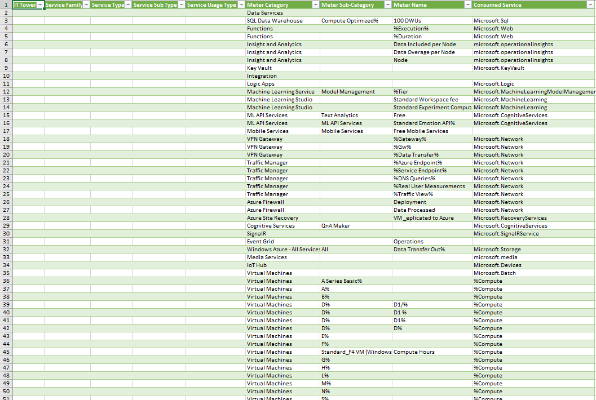

# Облачная лаба 2

## Цель работы:
Получение навыков аналитики и понимания спектра публичных облачных сервисов без привязки к вендору. Формирование у студентов комплексного видения Облака. 
## Дано: 
* Данные лабораторной работы 1.
* Слепок данных биллинга от провайдера после небольшой обработки в виде SQL-параметров. Символ % в начале/конце означает, что перед/после него может стоять любой набор символов.
* Образец итогового соответствия, что желательно получить в конце. В этом же документе

Слепок данных биллинга от провайдера

## Необходимо: 
* Импортировать файл .csv в Excel или любую другую программу работы с таблицами. Для Excel делается на вкладке Данные – Из текстового / csv файла – выбрать файл, разделитель – точка с запятой.
* Распределить потребление сервисов по иерархии, чтобы можно было провести анализ от большего к меньшему (напр. От всех вычислительных ресурсов Compute дойти до конкретного типа использования - Выделенной стойка в датацентре Dedicated host usage). При этом сохранять логическую концепцию, выработанную в Лабораторной работе 1.
* Сохранить файл и залить в соответствующую папку на Google Drive.

## Алгоритм работы:
Сопоставить входящие данные от провайдера с его же документацией. Написать в соответствие колонкам справа значения 5 колонок слева, которые бы однозначно классифицировали тип сервиса. Для столбцов IT Tower и Service Family значения можно выбрать из образца. В ходе выполнения работы не отходить от принципов классификации, выбранных в Лабораторной работе 1. Например, если сервис Машинного обучения был разбит на Вычислительные мощности и Облачные сервисы, то продолжать его разбивать и в новых данных.

## Результаты

Заполняю таблицу в соответствии с алгоритмом работы, описанном в задании

## Описание сервисов

### SQL Data Warehouse
Это решение для хранения данных нового поколения в Microsoft Fabric. Оно построено на базе механизма распределенной обработки корпоративного уровня, сводя к минимуму потребность в настройке и управлении. 
### Azure Functions
Данная служба, предоставляет всю постоянно обновляемую инфраструктуру и ресурсы, необходимые для запуска приложений. Functions обеспечивают бессерверные вычисления для Azure. Из можно использовать для создания веб-API, реагирования на изменения базы данных, обработки потоков Интернета вещей, управления очередями сообщений и многого другого.
### Operational Insights
Является функцией Dynamics 365 Commerce, предназначенная для того, чтобы предоставить клиентам лучший обзор работоспособности их служб и бизнес-функциональности путем отправки телеметрии непосредственно в принадлежащую клиенту учетную запись Application Insights.
### Azure Key Vault
Это одно из нескольких решений по управлению ключами в Azure, которое помогает решить следующие проблемы: управление секретами, управление ключами, управление сертификатами,   
### Azure Machine Learning
Данная облачная служба предназначена для ускорения жизненного цикла проекта машинного обучения (ML) и управления им. Специалисты по машинному обучению, специалисты по обработке данных и инженеры могут использовать его в своих повседневных рабочих процессах для обучения и развертывания моделей, а также управления операциями машинного обучения (MLOps)
### Azure VPN Gateway
Эта служба позволяет отправлять зашифрованные данные между виртуальной сетью Azure и локальными устройствами через Интернет.
### Azure Traffic Manager
Это служба, которую можно использовать для отправки зашифрованного трафика между виртуальной сетью Azure. Она является балансировщиком нагрузки трафика на основе DNS. Эта служба позволяет распределять трафик общедоступных приложений по глобальным регионам Azure. 
### Azure Firewall
Является облачной интеллектуальной службой безопасности сетевого брандмауэра, которая обеспечивает защиту от угроз для облачных рабочих нагрузок, выполняемых в Azure. Это межсетевой экран с полным сохранением состояния как услуга со встроенными функциями высокой доступности и неограниченной облачной масштабируемостью
### Azure Site Recovery
Служба помогает обеспечить непрерывность в работе приложения, поддерживая его работу во время сбоев. Site Recovery реплицирует рабочие нагрузки, выполняемые на физических и виртуальных машинах (ВМ), с основного сайта на дополнительный. 
### SignalR
Это библиотека для разработчиков ASP.NET, которая упрощает процесс добавления веб-функций реального времени в приложения
### Azure Event Grid
Это полностью управляемая и масштабируемая служба распространения сообщений Pub Sub, которая предлагает гибкие шаблоны потребления сообщений с использованием протоколов MQTT и HTTP
### Azure IoT Hub
Azure IoT Hub — это управляемая служба, размещенная в облаке, которая действует как центральный центр сообщений для связи между приложением IoT и подключенными к нему устройствами.

## Вывод:

В этой лабораторной работе познакомился с сервисами Azure и изучил их документацию, а также классифицировал их услуги из
слепка данных провайдера.