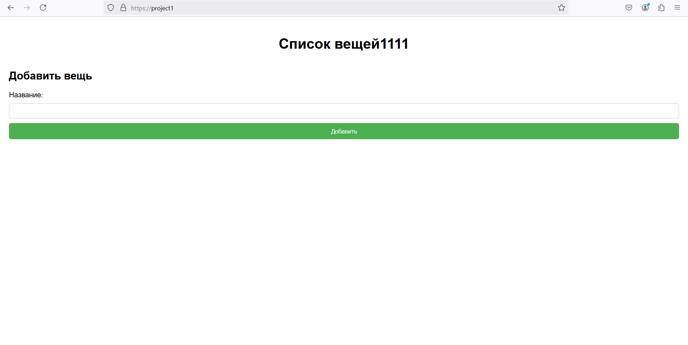

# Отчёт по первой лабе обычной
Для начала я настроил два небольших веб-сервиса - webservice1 и webservice2, у каждого из них был backend на Flask и фронт из одной html-страницы. Оба бекенда я поднял с помощью docker-compose, в нём же поднял nginx.

Далее принялся за настройку nginx. В нём я прописал 4 сервера: 2 для прослушивания 80 порта, с server_name project1 и project2, которые возвращают 301 https://project1$request_uri и 301 https://project1$request_uri, для перенаправления на https.

Вот так выглядит этот блок:
```
server {
    listen 80;
    server_name project1;
    return 301 https://project1$request_uri;
}
server {
    listen 80;
    server_name project2;
    return 301 https://project2$request_uri;
}
```

После этого я начал настраивать https. Я расскажу как делал это в целом, поскольку для двух веб-сервисов процесс абсолютно один и тот же (там буквально один и тот же код).

Первым делом я сделал самоподписанный сертификат с помощью certbot через wsl на виртуальной ubuntu, поскольку эта утилита не поддерживается на windows. Скопировав файлы .crt и .key сертификата в папку ssl в моём проекте, я прописал следующее в конфиге nginx:
```
server {
        listen 443 ssl;
        server_name project1;
        ssl_certificate /etc/ssl/SERT_NAME.crt;
        ssl_certificate_key /etc/ssl/SERT_NAME.key;
```
Здесь я слушаю порт 443(базовый порт https) с сертификатом (ssl). Дальше указываю server_name и путь до .crt и .key файлов. Пути в nginx отличаются от путей в проекте, поскольку в докере я их копирую в другое место, которое как раз и указано в конфиге nginx.

Далее я настраиваю путь для фронтенда, он у меня будет просто на базовой странице, т.е https://project1/. И с помощью alias указываю путь до html-файла.

```
server {
    listen 443 ssl;
    server_name project1;
    ssl_certificate /etc/ssl/SERT_NAME.crt;
    ssl_certificate_key /etc/ssl/SERT_NAME.key;

    location / {
        autoindex on;
        alias /var/www/frontend1/;
    }
}
```

И в самом конце настраиваю proxy_pass для backend составляющей:

```
server {
    listen 443 ssl;
    server_name project1;
    ssl_certificate /etc/ssl/SERT_NAME.crt;
    ssl_certificate_key /etc/ssl/SERT_NAME.key;

    location / {
        autoindex on;
        alias /var/www/frontend1/;
    }

    location /api/ {
        proxy_pass http://backend1:5001/;
    }
}
```

Теперь, если запустить весь проект с помощью команды ```docker-compose up```, то всё поднимется и даже не упадёт с ошибками, но есть одна проблема - с доменными именами. Если попробовать перейти по любому из доменных имён, например, https://project1/, то мы не достучимся до сайта. Возможно, если поместить проект на сервер, то проблема исчезнет, но на локалке нужно добавить оба домена в файл hosts, я это делал с помощью приложения Power Toys на windows 

И только после этого весь проект будет работать как надо.

## Красивые картинки, что всё работает


Касперский ругается на самоподписанный сертификат)



Сам сайт


Второй сайт


Работающее первое API


Работающее второе API


Файл hosts
