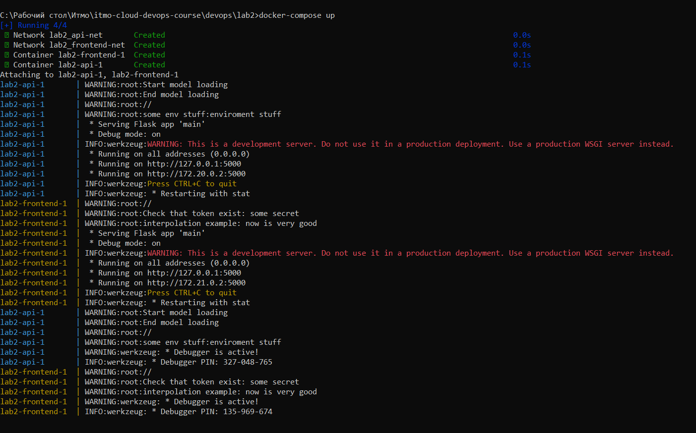
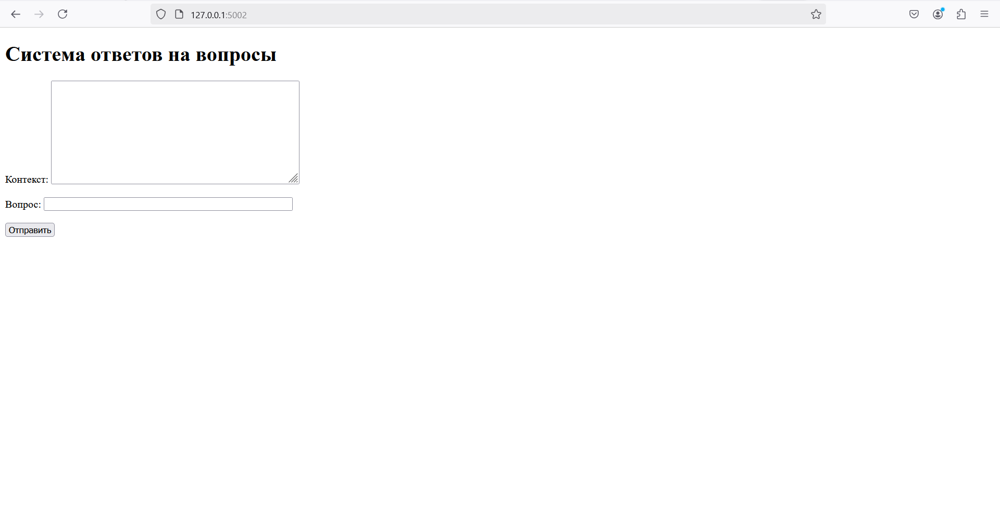
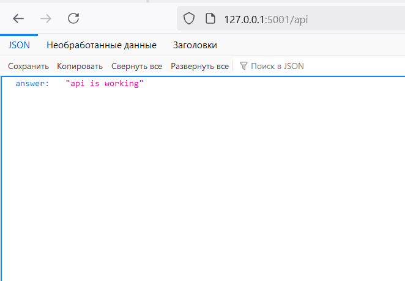

# Отчёт по второй лабе обычной

Для обычной лабораторной я делал докерфайлы для api. Рассмотрим их.

Для начала указываю базовый образ контейнера, в моём случае

Для полохого файла: ```FROM python:latest```

Для хорошего файла: ```FROM python:3.11-bookworm```

После чего перехожу к установке зависимостей:

Для полохого файла: ```RUN pip install -r requirements.txt```

Для хорошего файла: ```RUN --mount=type=bind,source=/model_api/requirements.txt,target=/tmp/requirements.txt \
    pip install --requirement /tmp/requirements.txt```

Далее я копирую папку model_api, в которой находится всё необходимое для работы приложения

Для обоих файлов: ```COPY ../model_api/ .```

И в конце запускаю моё приложение

Для обоих файлов```CMD ["python", "main.py"]```

Теперь разберём плохие практики

## Плохая практика один (одын)

Использовать последнюю версию образа контейнера. При появлении новой версии работоспособность и безопасность приложения может быть нарушена: некоторые функции могут устареть и появиться новые дыры в безопасности, которые злоумышленники могут попытаться использовать.

Исправил задав явно нужную мне версию образа с помощью
```FROM python:3.11-bookworm```
Теперь поведение контейнера не будет меняться при выходе новых версий

## Плохая практика два

Копировать временные файлы в контейнер (например requirements.txt). Их можно поместить во временную папку и устанавливать оттуда. При этом во время работы в контейнере их не будет

Вот команда, которую я использовал:

```RUN --mount=type=bind,source=/model_api/requirements.txt,target=/tmp/requirements.txt pip install --requirement /tmp/requirements.txt```

Теперь лишние данные можно не копировать в контейнер

## Плохая практика три (3)

Добавлять в контейнер лишние файлы, например requirements.txt, которые мы теперь используем временно, .md файлы и так далее.

Их можно добавить в файл со специальным разрешением .dockerignore

Так ненужные данные можно не добавлять в контейнер

## Две плохих практики по работе с контейнерами

1) Запуск контейнера от имени администратора. В таком случае процессам внутри контейнера предоставляется полный доступ к системе хоста. Из-за этого нарушается безопасность: если кто-то получит доступ к докеру, то он получит контроль над хостовой системой
2) Использование docker exec для запусков процессов вручную. Использование этой команды для настройки пайплайна контейнера неуместна, так как одини из важных принципов контейнеризации нарушен - автоматизация, маштабирование и универсальность

# Отчёт по второй лабе со звёздочкой

## Плохая практика один (раз)

Явно задавать переменные окружения. Можно использовать .env файлы для их хранения. Так их можно явно не прописывать

Исправил созданием .env файла

Теперь все переменные окружения хранятся в одном файле .env

## Плохая практика два

Открыто хранить и передавать секретные данные, например токены.

Для этого стоит использовать secrets и записывать их в специальные файлы (я специально залил всё на гит, чтобы можно было просто склонировать репо и потестить, я понимаю, что такие файлы нельзя куда-то выкладывать)

Теперь наши приватные данные никому не видны

## Плохая практика три

Не использовать интерполяцию для часто меняющихся данных. Например, если нужно задавать переменные окружения для тестов, то, чтобы каждый раз не лезть в файл docker-compose, можно сделать несколько разных .env файлов и подгружать их оттуда.

Добавил в docker-compose файле в поле переменных окружения выражение вида ```${VAR}```

Теперь можно заменить все переменные окружения одним действием - заменой файла

## Изоляция контейнеров

Добился изоляции контейнеров, поместив их в разные сети с помощью networks в docker-compose. Теперь контейнеры находятся не в общей сети, а каждый в своей, поэтому они не могут друг друга «видеть»


## Красивые картиночки, что всё работает:



Запуск docker-compose



Фронт на localhost



API на localhost