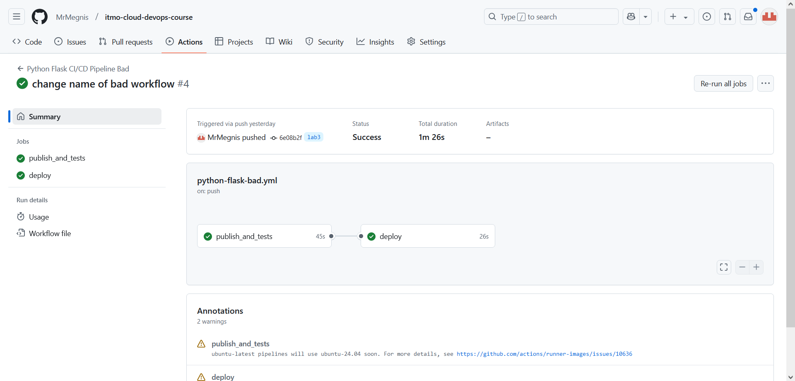
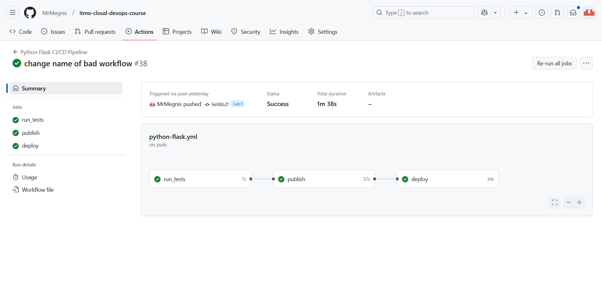
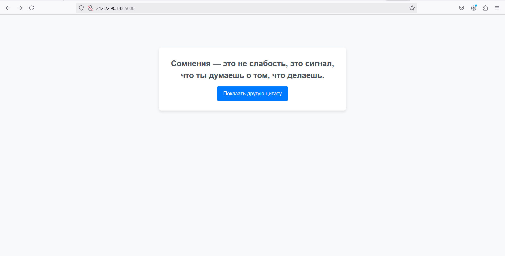
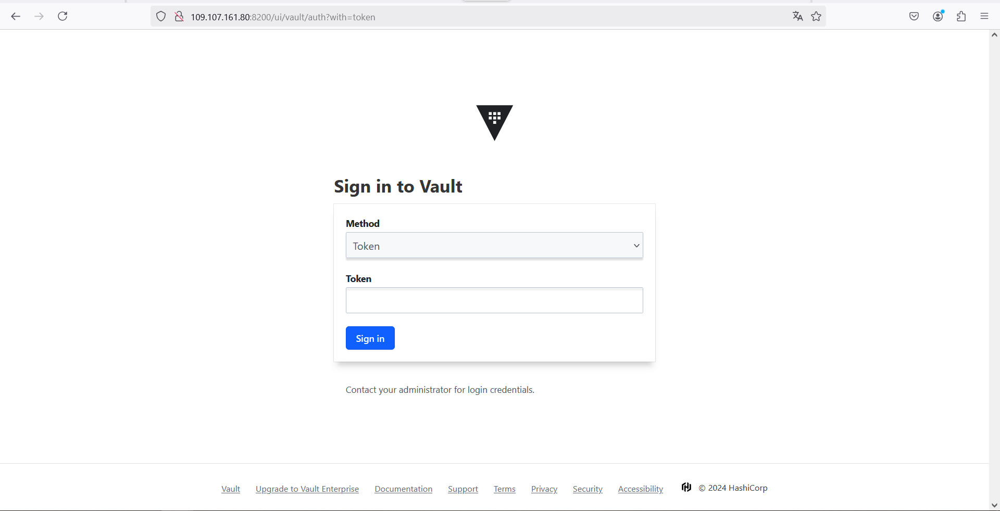

# Отчёт по третей лабе обычной

Это я, начинающий делать лабу и думающий, что супер легко и быстро настрою CI/CD и залутаю 100500 баллов/наносек:


## Как работает мой CI/CD Pipline? 
В пайплайне я выделил 3 основных момента:
* Тестирование
* Публикация докер образа на docker hub
* Деплой этого образа на моём сервере

Первый этап - тесты. Тут всё просто, настраиваю питоновское окружение и запускаю тесты с помощью unittest

В плохом файле
```
    runs-on: ubuntu-latest
    steps:
      - uses: actions/checkout@v3
      - uses: actions/setup-python@v4
        with:
          python-version: '3.11'
      - run: |
          python -m pip install --upgrade pip
          pip install -r requirements.txt
      - run:
          python -m unittest devops/lab3/tests/test_app.py
```
В хорошем файле
```
    runs-on: ubuntu-20.04
    timeout-minutes: 10
    steps:
      - name: Checkout code
        uses: actions/checkout@v3

      - name: Set up Python
        uses: actions/setup-python@v4
        with:
          python-version: '3.11'

      - name: Install dependencies
        run: |
          python -m pip install --upgrade pip
          pip install -r requirements.txt

      - name: Run tests
        run:
          python -m unittest devops/lab3/tests/test_app.py
```

После этого публикую образ на docker hub с помощью консольной утилиты для docker:
В плохом файле:
```
  - run: echo $DOCKER_PWD | docker login -u $DOCKER_LOGIN --password-stdin
  - run: echo ${GITHUB_REF}

  - uses: actions/checkout@main
  - run: docker build -t $DOCKER_LOGIN/$DOCKER_NAME:${GITHUB_REF:11} -f devops/lab3/web/Dockerfile .

  - run: docker push $DOCKER_LOGIN/$DOCKER_NAME:${GITHUB_REF:11}
```

В хорошем файле:

```
  - name: Login
    run: echo $DOCKER_PWD | docker login -u $DOCKER_LOGIN --password-stdin
  - name: Debug GitHub ref
    run: echo ${GITHUB_REF}

  - uses: actions/checkout@main
  - name: Build
    run: docker build -t $DOCKER_LOGIN/$DOCKER_NAME:${GITHUB_REF:11} -f devops/lab3/web/Dockerfile .

  - name: Push
    run: docker push $DOCKER_LOGIN/$DOCKER_NAME:${GITHUB_REF:11}
```

О том, как я делаю секреты распишу ниже, в отдельном отчёте, здесь же уделю внимание именно самому CI/CD

И, наконец этап деплоя. Он оказался самым муторным и сложным. Но для начала приведу его код:

В плохом файле:
```
  - run: echo "TAG=$(echo ${GITHUB_REF:11})" >> $GITHUB_ENV

  - run: |
      curl --silent --show-error --fail -X POST "$DEPLOYMENT_SERVER" \
        -H "Authorization: $DEPLOYMENT_TOKEN" \
        -H "Content-Type: application/json" \
        -d '{
          "owner": "'"$DOCKER_LOGIN"'",
          "repository": "'"$DOCKER_NAME"'",
          "tag": "'"${{ env.TAG }}"'",
          "ports": {"5000": 5000}
        }'
```
В хорошем файле:
```
  - name: Set Tag
    run: echo "TAG=$(echo ${GITHUB_REF:11})" >> $GITHUB_ENV

  - name: Send webhook for deploy
    run: |
      curl --silent --show-error --fail -X POST "$DEPLOYMENT_SERVER" \
        -H "Authorization: $DEPLOYMENT_TOKEN" \
        -H "Content-Type: application/json" \
        -d '{
          "owner": "'"$DOCKER_LOGIN"'",
          "repository": "'"$DOCKER_NAME"'",
          "tag": "'"${{ env.TAG }}"'",
          "ports": {"5000": 5000}
        }'
```
Опять же, работу с секретами тут опущу. В джобе для деплоя глобально я делаю следующую вещь: отправляю запрос на мой
сервер где должно разворачиваться приложение с данными о том, какой контейнер нужно стянуть и запустить. Обрабатывает
эти запросы python-flask приложение, запущенное на порте 8000. Большая проблема возникла с поднятием этого приложения
и запросом к нему. Я поднимал его как отдельный сервис с помощью systemd, который по многим проблемам отказывался работать,
но в итоге всё заработало и тут появилась другая проблема - запрос никак не хотел проходить. В итоге оказалось, что
curl имеет неправильный формат, поэтому отправлял битые данные.

И вот, когда я всё пофиксил, мой пайплайн наконец-то заработал:
Плохой файл:

Хороший файл:

И сам сайт:


Сайт рабочий и его даже можно потыкать: http://212.22.90.135:5000/

А на порту 8000 вы найдёте апишку для деплоя, которая вас не пустит, потому что нужен токен)


А вот сами плохие практики:

## Плохая практика 1

Запускать джобу на последней доступной версии

Например

```runs-on: ubuntu-latest```

Если последняя версия будет не совместима с используемыми приложениями или командами, которые использовались при создании, то CI/CD будет падать с ошибкой.

Чтобы исправить я указываю конкретную версию:

```runs-on: ubuntu-20.04```

## Плохая практика 2

Не использовать нейминг в джобах

Например вместо
```
- name: Set up Python
uses: actions/setup-python@v4
with:
  python-version: '3.11'
```
Писать
```
uses: actions/setup-python@v4
with:
  python-version: '3.11'
```
Не всегда понятно, что происходит, а такой нейминг позволяет гораздо быстрее и легче ориентироваться в пайплайне

## Плохая практика 3

Не использование зависимостей для джобов

Допустим какая-то джоба должна запускаться только, если другая выполниться без ошибок (в моём случае это деплой приложения deploy после публикации контейнера publish), то нужно это явно прописать в пайплайне:

```
  publish_and_tests:
    ...
  deploy:
    needs: publish_and_tests
    ...
```

## Плохая практика 4

Тесты и публикация образа на докер хаб в одной джобе. Это осложняет читаемость и отладку.

```
  publish_and_tests:
    ...
  deploy:
    ...
```

В "хорошем" CI/CD я разделил эту джобу на две. В итоге получил такой пайплайн:

```
  run_tests:
    ...
  publish:
  needs: run_tests
    ...
  deploy:
    needs: publish
    ...
```

## Плохая практика 5

У джобов нет ограничения по времени, так что теоретически, они могут выполняться бесконечно, либо очень долго, особенно, когда происходят запросы в интернет.

Чтобы это исправить, добавляю ограничение на исполнение в 10 минут:

```
  run_tests:
    runs-on: ubuntu-20.04
    timeout-minutes: 10
    ...
    
  publish:
    needs: run_tests
    runs-on: ubuntu-20.04
    timeout-minutes: 10
    ...
    
  deploy:
    needs: [ publish ]
    runs-on: ubuntu-20.04
    timeout-minutes: 10
    ...
```

# Отчёт по третей лабе со звёздочкой
Или как я три дня не спал


Это я

Начну свой рассказ с того, что я решил потестить очень дешёвый и маломощный сервер, который имел всего 512 мб озу. Тогда
я ещё не предполагал, что туда с трудом поместятся два приложения, не говоря уже о трёх. В итоге я целый день провозился
с Hascorp Vault (именно это хранилище секретов я выбрал), дак ещё и не использовал докер для его запуска.


Я, когда понял, что с хранилищем секретов не всё так легко...

Но в итоге я принял решение не запихивать невпихуемое и арендовал ещё один сервер специально для хранилища секретов и на
этот раз обернул его в докер (по совету Тани, спасибо ей большое, я не знаю, почему я сразу так не сделал). Но вот беда:
теперь приложение запускается, но не хочет работать! Ошибка какая-то странная, пишется, что используемый порт для
приложения уже занят. Что я только не переделал и не пересмотрел... Пожалуй, не буду это всё перечислять, просто покажу,
как я выглядел в 3 часа ночи, после очередного упавшего контейнера:

Ошибку я нашёл просто... загуглив. Оказывается, если я настраиваю хранилище с помощью конфига и добавляю прослушивание
на порт, то у меня создаётся два слушателя, потому что один создаётся по-умолчанию.

Наконец-то боги девопса сжалились надо мной и моё хранилище секретов заработало (даже ui есть http://109.107.161.80:8200/ui/)



Добавив все секреты, мне предстояла не менее тяжёлая работа: заменить все секреты гита на мои...
В итоге в файлах появились следующие шаги:

Плохой файл:
```
steps:
  - run: |
      curl -fsSL https://apt.releases.hashicorp.com/gpg | gpg --dearmor > hashicorp.gpg
      sudo install -o root -g root -m 644 hashicorp.gpg /usr/share/keyrings/hashicorp-archive-keyring.gpg
      echo "deb [signed-by=/usr/share/keyrings/hashicorp-archive-keyring.gpg] https://apt.releases.hashicorp.com $(lsb_release -cs) main" | sudo tee /etc/apt/sources.list.d/hashicorp.list
      sudo apt-get update && sudo apt-get install vault

  - run: |
      export VAULT_ADDR=${{ secrets.VAULT_SERVER }}
      vault login -method=userpass username=${{ secrets.VAULT_LOGIN }} password=${{ secrets.VAULT_PWD }}

  - run: |
      export VAULT_ADDR=${{ secrets.VAULT_SERVER }}
      DEPLOYMENT_SERVER=$(vault kv get -field=DEPLOYMENT_SERVER kv/lab3-secret)
      DEPLOYMENT_TOKEN=$(vault kv get -field=DEPLOYMENT_TOKEN kv/lab3-secret)
      DOCKER_LOGIN=$(vault kv get -field=DOCKER_LOGIN kv/lab3-secret)
      DOCKER_NAME=$(vault kv get -field=DOCKER_NAME kv/lab3-secret)
      DOCKER_PWD=$(vault kv get -field=DOCKER_PWD kv/lab3-secret)
      echo "DEPLOYMENT_SERVER=$DEPLOYMENT_SERVER" >> $GITHUB_ENV
      echo "DEPLOYMENT_TOKEN=$DEPLOYMENT_TOKEN" >> $GITHUB_ENV
      echo "DOCKER_LOGIN=$DOCKER_LOGIN" >> $GITHUB_ENV
      echo "DOCKER_NAME=$DOCKER_NAME" >> $GITHUB_ENV
      echo "DOCKER_PWD=$DOCKER_PWD" >> $GITHUB_ENV
      echo "::add-mask::$DEPLOYMENT_SERVER"
      echo "::add-mask::$DEPLOYMENT_TOKEN"
      echo "::add-mask::$DOCKER_LOGIN"
      echo "::add-mask::$DOCKER_NAME"
      echo "::add-mask::$DOCKER_PWD"
```

Хороший файл:

```
steps:
  - name: Install Vault CLI
    run: |
      curl -fsSL https://apt.releases.hashicorp.com/gpg | gpg --dearmor > hashicorp.gpg
      sudo install -o root -g root -m 644 hashicorp.gpg /usr/share/keyrings/hashicorp-archive-keyring.gpg
      echo "deb [signed-by=/usr/share/keyrings/hashicorp-archive-keyring.gpg] https://apt.releases.hashicorp.com $(lsb_release -cs) main" | sudo tee /etc/apt/sources.list.d/hashicorp.list
      sudo apt-get update && sudo apt-get install vault

  - name: Login to Vault
    run: |
      export VAULT_ADDR=${{ secrets.VAULT_SERVER }}
      vault login -method=userpass username=${{ secrets.VAULT_LOGIN }} password=${{ secrets.VAULT_PWD }}

  - name: Fetch secrets from Vault
    run: |
      export VAULT_ADDR=${{ secrets.VAULT_SERVER }}
      DEPLOYMENT_SERVER=$(vault kv get -field=DEPLOYMENT_SERVER kv/lab3-secret)
      DEPLOYMENT_TOKEN=$(vault kv get -field=DEPLOYMENT_TOKEN kv/lab3-secret)
      DOCKER_LOGIN=$(vault kv get -field=DOCKER_LOGIN kv/lab3-secret)
      DOCKER_NAME=$(vault kv get -field=DOCKER_NAME kv/lab3-secret)
      DOCKER_PWD=$(vault kv get -field=DOCKER_PWD kv/lab3-secret)
      echo "DEPLOYMENT_SERVER=$DEPLOYMENT_SERVER" >> $GITHUB_ENV
      echo "DEPLOYMENT_TOKEN=$DEPLOYMENT_TOKEN" >> $GITHUB_ENV
      echo "DOCKER_LOGIN=$DOCKER_LOGIN" >> $GITHUB_ENV
      echo "DOCKER_NAME=$DOCKER_NAME" >> $GITHUB_ENV
      echo "DOCKER_PWD=$DOCKER_PWD" >> $GITHUB_ENV
      echo "::add-mask::$DEPLOYMENT_SERVER"
      echo "::add-mask::$DEPLOYMENT_TOKEN"
      echo "::add-mask::$DOCKER_LOGIN"
      echo "::add-mask::$DOCKER_NAME"
      echo "::add-mask::$DOCKER_PWD"
```

Я привёл шаги только из джобы deploy, потому что в publication они идентичны

В этой части кода я скачиваю утилиту для работы с Hashicorp Vault, после чего логинюсь под созданным пользователем
с правами только на чтение и стягиваю секреты в переменные окружения, добавляя сокрытие в логах (а то один раз я
засветил все секреты...)

На этом мои приключения окончились и я отправился сладко спать, ведь на следующий день мне предстояло написать 3 работы
по физике...


Сладко сплю, сделав всю лабу